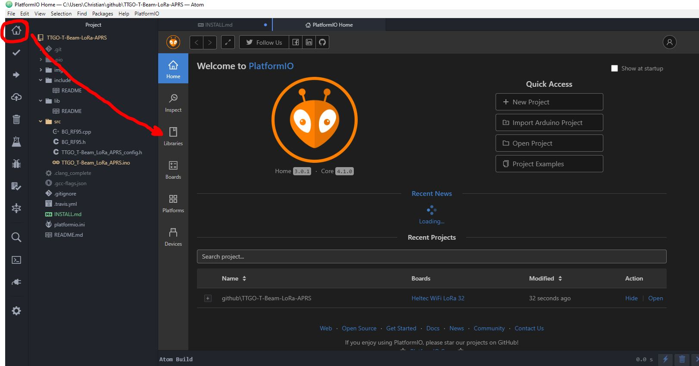

<h2>Installation Guide for PlatformIO</h2>
 
Press the PlatformIO HOME Button to enter the Home Screen and there the Libraries Button to add missing libraries: 
 
Search and install the following libaries: 
<ul>
<li>RadioHead</li>
<li>TinyGPSPlus</li>
<li>DHT sensor library for ESPx</li>
<li>Adafruit SSD1306</li>
<li>Adafruit GFX Library</li>
<li>Adafruit Unified Sensor</li>
<li>AXP202X_Library</li>
</ul>
 
Check that the platformio.ini is available as it holds the board type for PlatformIO. 
After pressing the check mark the code will be compiled, after pressing the arrow it will be compiled and uploaded to a connected TTGO. 
